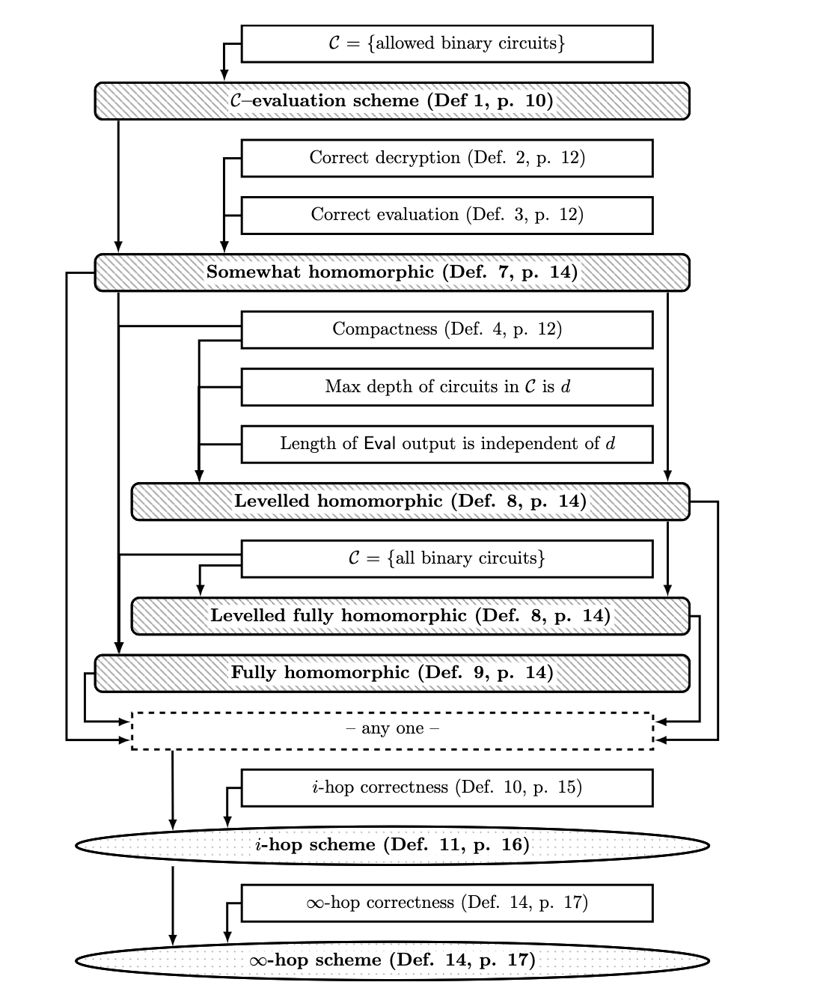
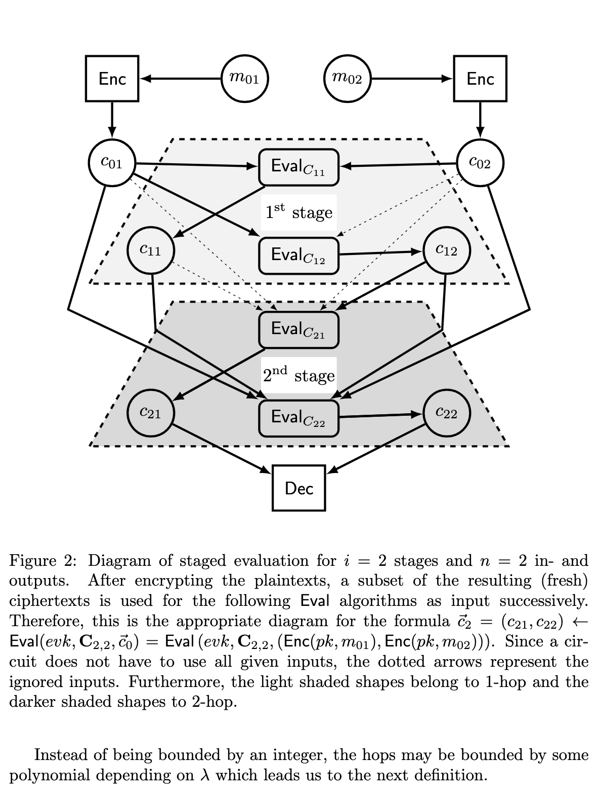
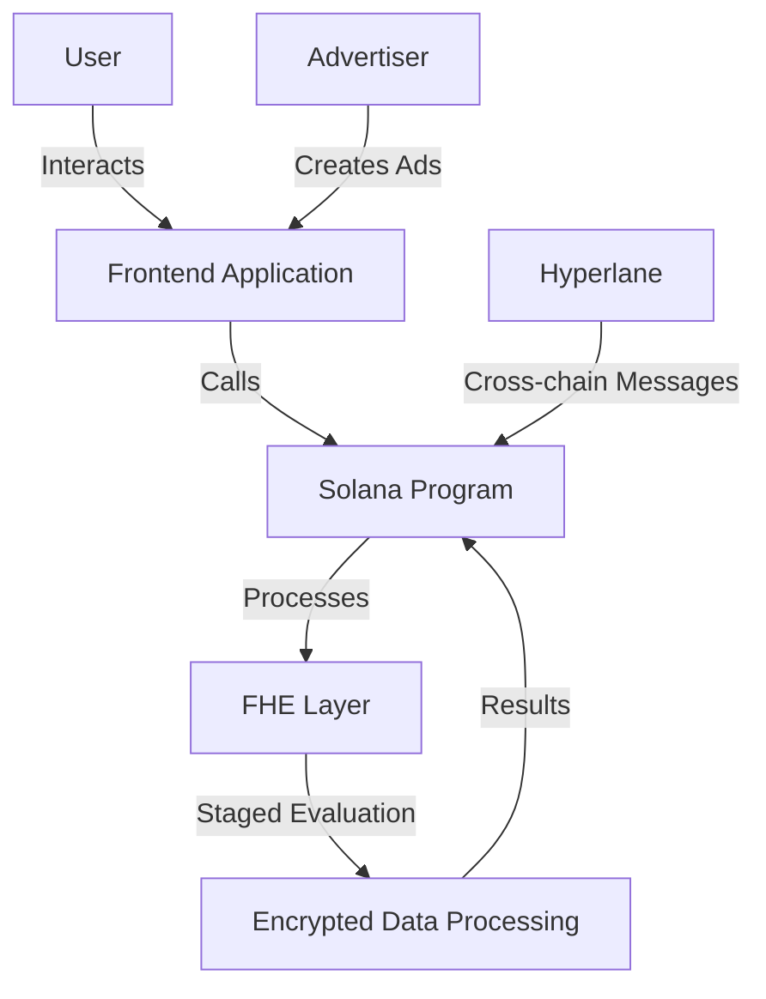

# solFHE(λ): Fully Homomorphic Encryption-based Advertising on Solana

<div align="center">
  
</div>

[](https://opensource.org/licenses/MIT)
[](https://solana.com/)
[](https://project-serum.github.io/anchor/)
[](https://nextjs.org/)
[](https://eprint.iacr.org/2015/1192.pdf)

## Table of Contents

- [Introduction](#introduction)
- [Features](#features)
- [FHE Implementation](#fhe-implementation)
- [Architecture](#architecture)
- [Installation](#installation)
- [Usage](#usage)
- [Completed Steps](#completed-steps)
- [Roadmap](#roadmap)
- [Contributing](#contributing)
- [License](#license)

## Introduction

SolFHE is a groundbreaking project that combines the power of Fully Homomorphic Encryption (FHE) with Solana's high-performance blockchain to create a privacy-preserving, decentralized advertising platform. By leveraging FHE, SolFHE allows for personalized ad targeting without compromising user data privacy.

### What is Fully Homomorphic Encryption?

Fully Homomorphic Encryption (FHE) is a revolutionary form of encryption that allows computations to be performed on encrypted data without decrypting it first. This enables secure, privacy-preserving data processing in untrusted environments, making it ideal for applications like our decentralized advertising platform.

## Features

- **Privacy-Preserving Ad Targeting**: Utilize user data for ad matching without exposing sensitive information.
- **High-Performance**: Built on Solana for fast, low-cost transactions.
- **Cross-Chain Compatibility**: Interact with other blockchains through Hyperlane integration.
- **Advertiser Dashboard**: Easy-to-use interface for creating and managing ad campaigns.
- **User Control**: Users have full control over their data and can choose to participate in ad programs.
- **Transparent Reporting**: Blockchain-based verification of ad performance and payments.
- **Advanced FHE Operations**: Implement sophisticated homomorphic operations for secure data processing.

## FHE Implementation

SolFHE utilizes cutting-edge FHE techniques to ensure maximum privacy and security. Our implementation is based on state-of-the-art research in homomorphic encryption.

### Staged Evaluation

We implement a staged evaluation process for our FHE operations, as illustrated in the following diagram:



This multi-stage approach allows for complex computations on encrypted data, enabling sophisticated ad matching algorithms without compromising user privacy.

### Homomorphic Scheme Hierarchy

Our FHE implementation follows a hierarchical structure of homomorphic schemes, ensuring both efficiency and security:



This hierarchy allows us to optimize our FHE operations based on the specific requirements of each computation, balancing performance and security.

## Architecture

SolFHE consists of three main components:

1. **Solana Program**: A Rust-based smart contract that handles core functionality and interacts with the FHE layer.
2. **Frontend Application**: A Next.js application that provides the user interface for advertisers and users.
3. **FHE Layer**: Implements the Fully Homomorphic Encryption for secure data processing, including the staged evaluation and homomorphic scheme hierarchy.



## Installation

To set up the SolFHE project locally, follow these steps:

```bash
# Clone the repository
git clone https://github.com/your-username/solfhe.git
cd solfhe

# Install dependencies for the Solana program
cd program
cargo build

# Install dependencies for the frontend
cd ../frontend
npm install

# Set up environment variables
cp .env.example .env.local
# Edit .env.local with your specific configurations
```

## Usage

To run the project locally:

1. Start the Solana test validator:
   ```bash
   solana-test-validator
   ```

2. Deploy the Solana program:
   ```bash
   anchor deploy
   ```

3. Run the frontend application:
   ```bash
   npm run dev
   ```

4. Open your browser and navigate to `http://localhost:3000`

## Completed Steps

- [x] Initial project setup with Next.js and Solana integration
- [x] Implementation of basic smart contract structure
- [x] Creation of core components (AdCreation, AdMatching, UserDataInput)
- [x] Integration of Solana wallet adapter
- [x] Basic FHE operations setup
- [x] Implementation of program initialization in useProgram hook
- [x] Design of staged evaluation process for FHE
- [x] Definition of homomorphic scheme hierarchy

## Roadmap

- [ ] Complete implementation of FHE for secure data processing
  - [ ] Implement staged evaluation process
  - [ ] Optimize homomorphic scheme selection based on computation requirements
- [ ] Integrate Hyperlane for cross-chain functionality
- [ ] Develop advertiser dashboard with advanced analytics
- [ ] Implement user rewards system for data sharing
- [ ] Conduct security audits and optimize performance
  - [ ] Formal verification of FHE implementation
  - [ ] Performance benchmarking of homomorphic operations
- [ ] Launch beta testing program
- [ ] Mainnet deployment

## Contributing

We welcome contributions to the SolFHE project! Please follow these steps to contribute:

1. Fork the repository
2. Create a new branch: `git checkout -b feature/your-feature-name`
3. Make your changes and commit them: `git commit -m 'Add some feature'`
4. Push to the branch: `git push origin feature/your-feature-name`
5. Submit a pull request

Please read our [Contributing Guidelines](CONTRIBUTING.md) for more details.

## License

This project is licensed under the MIT License - see the [LICENSE](LICENSE) file for details.

---

<p align="center">
  Made with 🏗️ by @virjilakrum
</p>
